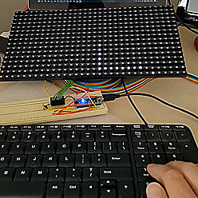

# snake-clone

A clone of the classic video game "Snake" for an Arduino Nano (or similar) device, using a LED matrix as the display.

## Demo

## Getting Started

The project sketch depends on the following 3rd-party libraries.

* `DMD` - "A library for driving the Freetronics 512 pixel dot matrix LED display "DMD"". Available [here](https://github.com/freetronics/DMD).
* `arduino-timerone` - A collection of functions used to simplify timer setup. Available [here](https://code.google.com/archive/p/arduino-timerone/downloads).

After these are added to the local `Arduino/libraries` directory, the sketch `snake-clone.ino` may be programmed on an Arduino device in the usual method using the Arduino IDE.

The LED matrix used in this project is the Techbrands XC4622 available and described [here](https://www.jaycar.com.au/white-led-dot-matrix-display-for-arduino/p/XC4622). The included sketch requires the following circuit to be constructed. 

| Arduino Pin Number | Pin Label | XC4622 Pin Number | Pin Label | 
| --- | --- | --- | --- |   
| - | +5V | - | Vcc\* |  
| - | GND | 15 | - |  
| 6 | D6 | 2 | A-D6 |  
| 7 | D7 | 4 | B-D7 |  
| 8 | D8 | 10 | SCLK-D9 |  
| 9 | D9 | 1 | OE-D9 |  
| 11 | D11 | 12 | DATA-D11 |  
| 13 | D13 | 8 | CLK-D13 |  

\* Where Vcc is either of the centre connectors on the back of the XC4622.

### Running

As with the standard Snake game, the objective is to direct the snake to reach the lone dot, the "fly", without colliding with itself. For each fly the snake eats, the snake grows in length by one unit - increasing the challenge.

An Arduino device programmed with this project sketch generates a snake and fly at random locations. After start up, the device immediately displays the snake moving in a random direction.

Before any snake step, the Arduino device checks for serial communication (at Baud rate 9600). Input is expected to be one of the following four characters.

* `2` - Change direction to down.
* `4` - Change direction to left.
* `6` - Change direction to right.
* `8` - Change direction to up.

When the Arduino device receives any of the above characters, the snake's direction is changed (if it involves a 90 degree turn). All other input is ignored.

### Game Pad

The included Python script `GamePad.py` was written to simplify the controls. This script generates a simple GUI with just four buttons - one for each direction. To simplify control further, with the GUI in focus, keyboard arrow keys may be used to direct the snake.

To run `GamePad.py`, the host machine must have the following installed:
* `Python3` - The programming language in which the script was written. Available [here](https://www.python.org/).
* `Tkinter` - The Python library required for the game pad user interface.\*

\*Included with the standard Python3 installation on Windows and MacOS, requires separate installation on Linux. For Debian-based systems, this is achieved through the following command:
`apt-get install python3-tk`

The game pad may be started with the command  
`python3 GamePad.py`

Before displaying the GUI, a command line prompt for the Arduino device's COM port appears. Simply submit the COM port's name (e.g. "COM3") to connect and start the game.

## Authors

* **Marc Katzef** - [mkatzef](https://github.com/mkatzef)

## Acknowledgements

* **Jaycar Electronics** - Part supplier and author of [this guide](https://www.jaycar.co.nz/diy-arduino-clock) showing how to interact with the LED matrix display.
